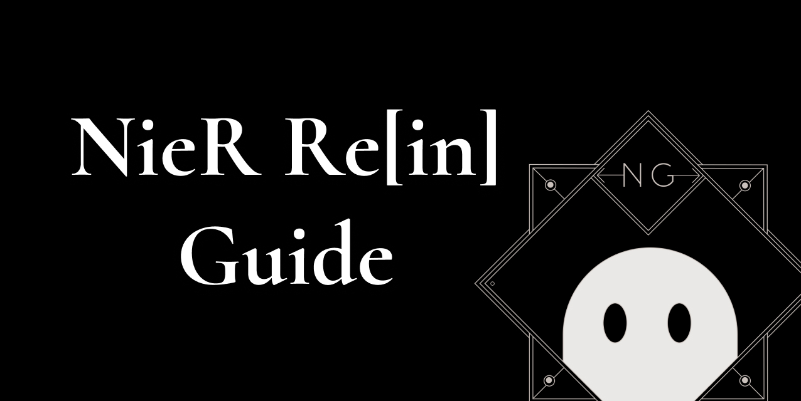

<p>
  
</p>

# https://nierrein.guide/

This is the frontend of https://nierrein.guide/.

You can join our Discord server to chat and contribute : https://discord.gg/swgHJJdt7f

## Features

- Guides
- Create Loadouts (Quests, Arena, Subj)
- Tier lists
- Characters/Costumes database
- Weapons database
- Companions database
- Memoirs database
- Debris database
- In-game notices
- To-do list
- Tools (Dark weapons calc, stam calc...)

## How to install the project ?

### Tech stack

#### Front-end

- [Next.js](https://nextjs.org/) (React)
- [TypeScript](https://www.typescriptlang.org/)
- [TailwindCSS](https://tailwindcss.com/)

#### Back-end

- [Wasabi](https://wasabi.com/) (S3 storage, but cheaper)
- [Strapi](https://strapi.io/) (CMS)

### Requirements

- Node.js (>16.17)

1. Copy the `.env.example` file to `.env`

You will need private keys, please join the Discord server and contact Keziah#6631.

2. Install the dependencies via NPM

```bash
npm install
```

3. Run the development server

```bash
npm run dev
```

4. Once you're done with the development, you can lint your code by running

```bash
npm run lint
```

```bash
npm run fix
```

## License

[MIT](./LICENSE)
